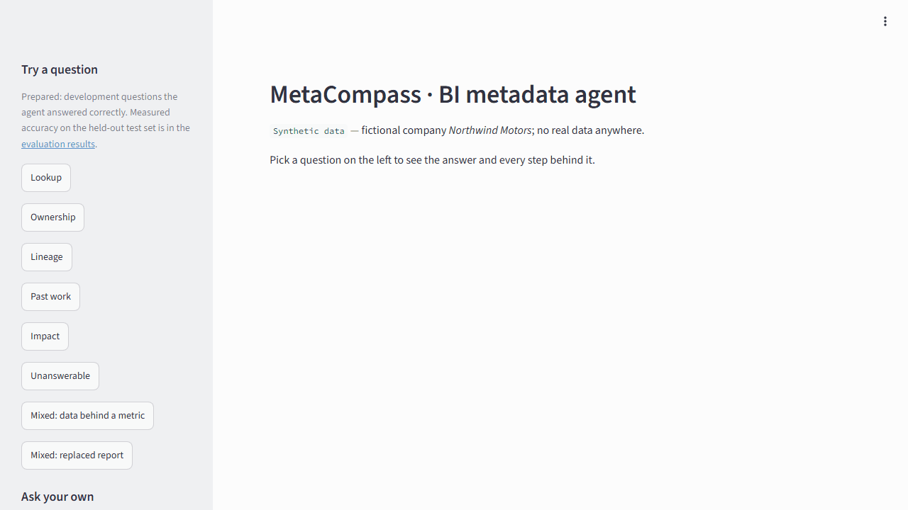
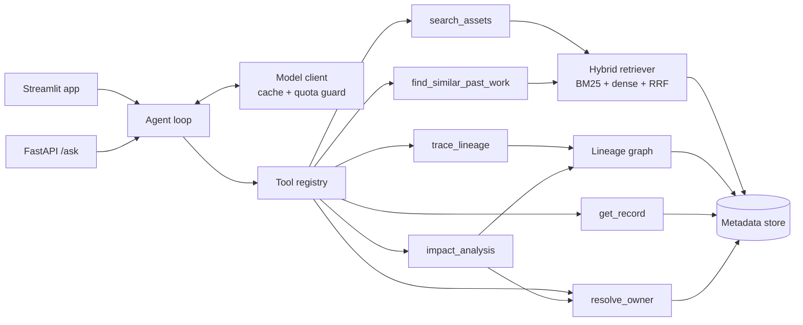

# MetaCompass

**A tool-using agent for BI metadata questions that knows when to abstain.**

[](https://github.com/ozandokur/metacompass/actions/workflows/tests.yml)
· [Live demo](https://metacompass.streamlit.app)
⏳ Asleep after a quiet day? Click "Yes, get this app back up!" and give it about a minute.

All data in this project is synthetic: a fictional car company, *Northwind Motors*, generated
by code from a fixed seed. The evaluation is running on a free-tier quota; the table below
fills in as the runs finish.



*Five states of the hosted demo: an impact question answered with the reports and the
people to notify, the agent trace behind it, a record opened from a chip, and a question
the agent refuses to answer.*

## Results (100-question test set, synthetic data)

<!-- results:start (generated by eval/report.py --readme-snippet; do not edit) -->
| Config | Lookup | Ownership | Lineage | Past work | Impact | Unanswerable | Mixed | Overall | Abstain P/R |
|---|---|---|---|---|---|---|---|---|---|
| A0 full | 0.73 ± 0.00 | 0.93 ± 0.00 | 1.00 ± 0.00 | 0.47 ± 0.00 | 0.60 ± 0.00 | 0.93 ± 0.00 | 0.73 ± 0.00 | 0.78 ± 0.00 | 0.61/0.93 |
| A1 dense-only | 0.87 | 1.00 | 0.93 | 0.67 | 0.60 | 1.00 | 0.87 | 0.86 | 0.79/1.00 |
| A2 bm25-only | 0.67 | 0.93 | 0.93 | 0.40 | 0.70 | 1.00 | 0.60 | 0.75 | 0.54/1.00 |
| A3 llm-walks-chain | — | 0.87 | — | — | 0.50 | — | 0.67 | 0.70 | 0.00/— |
| A4 no-abstain | 0.80 | 1.00 | 1.00 | 0.47 | 0.40 | 0.67 | 0.80 | 0.75 | 0.62/0.67 |
| A5 no-composite-impact | — | — | — | — | 0.00 | — | 0.80 | 0.48 | 0.00/— |

Read two things off this table before anything else. **An ablation beats the full system:** **A1 dense-only** (0.86) against A0's 0.78. Switching that part off bought accuracy rather than costing it, so on this question set the full system carries a component it has not earned.

**The ± is zero because the 3 repeats never disagreed** — same score on every question, at different latencies, so these were real calls. At temperature 0 this model is reproducible here, which also means the run has no measured noise floor to judge a one-run ablation against; the ablation marks in [eval/results.md](eval/results.md) rest on the pre-registered point bar alone.

<!-- results:end -->

A0 is the full system, three repeats (mean ± std); A1–A5 each switch one part off and run
once. Full results, the rules for reading them (written before the test run), ablations,
diagnostics and error analysis: [eval/results.md](eval/results.md).

## The problem

Data teams keep hundreds of reports, tables and metrics, and the same questions come back
every week: who owns this report now that its author has left, what breaks if I change this
table, has anyone analysed this before. Catalogs store the metadata; this project studies
the agent layer on top of it, and measures how often that agent is right, and how often it
knows it cannot be.

## What it answers

| Category | Example | What makes it hard |
|---|---|---|
| Lookup | "Which report tracks dealer-level service retention?" | Similar names, deprecated versions, paraphrases |
| Ownership | "The owner of RPT-0142 left. Who should I ask now?" | Succession and manager chains, a depth limit |
| Lineage | "Which tables feed the Gross Margin % metric?" | Direction and depth in a graph |
| Past work | "Has anyone analysed returns by region before?" | Paraphrase, semantic similarity |
| Impact | "If I change dim_customer, which reports break and whom do I notify?" | Graph + ownership + de-duplication, at scale |
| Unanswerable | "What is the 2027 budget for the North region?" | Looks answerable, is not in the metadata |
| Mixed | "Gross Margin % looks wrong. Who owns its source tables?" | Several of the above in one chain |

## How it works



- **Hybrid retrieval:** BM25 and dense embeddings, fused with reciprocal rank fusion, plus a
  match-quality signal that says when nothing really matched. The ablation above does not
  support the fusion: dense retrieval alone scored higher, and the retrieval benchmark shows
  why — RRF averages ranks, so on a query that names an ID the dense side, which never sees
  IDs, pulls BM25's first place down. It is kept and reported rather than quietly dropped.
- **Lineage graph:** a NetworkX DAG of tables, reports and metrics for upstream and
  downstream questions.
- **Deterministic ownership:** successor and manager chains are walked by code, with a depth
  limit, not by the model.
- **A plain tool-calling loop:** no agent framework, a bounded tool budget, and a structured
  final answer.
- **Grounding guard:** any ID the answer names that no tool returned is removed and reported.
- **Abstention:** prompt rules and the match-quality signal; unanswerable questions are part
  of the test set.

More in [docs/architecture.md](docs/architecture.md).

## Evaluation design

- **Sets:** a retrieval benchmark (60 queries), a dev set (30 questions) for prompt work, and
  a test set (100 questions) used only for the reported numbers.
- **Gold answers** come from independent code that reads the raw data; a bug in a tool cannot
  make its own answer look right.
- **Scoring** is deterministic, on answer IDs only: no LLM judges the text.
- **Ablations** are leave-one-out: each switches one part off against the full system.
- **Reading rules** were written in the results page before the test run and are pinned by
  a hash; every result line carries a fingerprint of the code it was produced with.

## Model, cost and limits

The agent runs on **Gemini Flash-Lite through the Google AI Studio free tier**, so the
project costs nothing to build or evaluate. That choice is a constraint the evaluation is
designed around, and it is recorded rather than hidden:

- **The model was chosen by measurement, not by preference.** The limits are per project and
  per model: the Flash models allow 20 requests a day, which is 167 days for this run plan,
  while the Lite class allows 500. Each candidate answered the same 30 development questions,
  and the rule for reading those runs was written in `eval/results.md` before they ran.
- **The limits shape the run plan.** The client waits to stay under the per-minute limits,
  learns the real daily limit from the first refusal, and a run stops cleanly when the day's
  quota is used up; the same command continues it the next day.
- **665 answers instead of 1,030.** The full system runs three times on the test set and
  every ablation once. Ablation differences are read against the full system's
  repeat-to-repeat spread and the share of questions its repeats disagree about.
- **The demo** answers 8 prepared questions from a cache, with no model call, on Streamlit
  Community Cloud's free tier. It has no model key, because its visitors would spend the daily
  quota the evaluation needs, and so it installs only what the app needs without a model:
  no torch, no embedding model. To ask your own questions, run it locally with your own key.

## Run it locally

Python 3.13:

```bash
python -m venv .venv
source .venv/bin/activate          # Windows: .venv\Scripts\activate
pip install -r requirements.txt    # CPU-only torch comes from the index in the file
pip install -e . --no-deps
python -m metacompass.data.generate --seed 42 --out data/
streamlit run app/streamlit_app.py
```

The eight prepared questions work without any key. To ask your own, copy `.env.example`
to `.env` and fill in `LLM_PROVIDER=google`, `LLM_MODEL=gemini-3.1-flash-lite`, your Google
AI Studio key as `LLM_API_KEY`, and your free-tier limits (`LLM_RPM_LIMIT`,
`LLM_RPD_LIMIT`, `LLM_TPM_LIMIT`). Questions then spend your own daily quota, five per
session. The same agent is served over HTTP by `uvicorn metacompass.api:app`.

### Optional: run it with Docker

```bash
docker build -t metacompass .
docker run -p 7860:7860 metacompass
```

The image (about 2.7 GB: CPU-only torch and the embedding model, with the data and the
document embeddings prepared at build time) serves the same app on port 7860. It is what a
Hugging Face Docker Space would run; `scripts/deploy_space.py` publishes it to one, which
needs a Hugging Face PRO account. The hosted demo uses the light profile instead:
`app/requirements.txt` installs only what the app needs without a model (about 390 MB).

## Limitations

These were left out on purpose; each line says what a production version would need.

- **No live connection to Power BI, Fabric, dbt or a catalog:** an adapter per source and a
  sync job.
- **No authentication or row-level permissions:** the agent must not suggest reports a user
  may not see.
- **No fine-tuning:** a general model with tools and prompts.
- **No vector database or graph database:** in-memory search and a NetworkX DAG fit this size;
  tens of thousands of assets would need an ANN index and a persistent graph.
- **No agent framework and no LLM-as-judge:** a plain loop and ID-based scoring, to keep every
  step explainable and every score reproducible.
- **English only, table-level lineage only, seven tables, six tools.**
- **No streaming answers or multi-user sessions, no real-time metadata sync.**
- **Synthetic data:** one fictional company generated by code; results may not carry over to
  real catalogues (see the threats to validity in the results page).

## Data

All data is synthetic and generated from a fixed seed; it contains no real company data. See
[docs/data_card.md](docs/data_card.md).

## License

MIT
