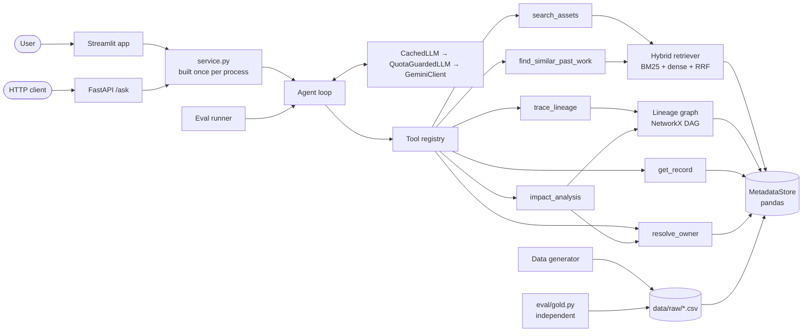

# Architecture

MetaCompass answers ownership, lineage and change-impact questions about the BI metadata of
a fictional company, Northwind Motors. All data is synthetic and generated by code.

## Components



## Layers

```
data (CSV)  →  store  →  indices (retrieval, graph)  →  tools  →  agent  →  service  →  api / app
                                                                   ↑
                                                              eval runner
eval/gold.py  →  CSV directly with pandas (imports none of the tools, graph or retrieval)
```

Dependencies only point to the right. `tests/test_architecture.py` enforces the rules
statically: tools never import the agent, retrieval never imports tools, `src` uses
absolute imports only, only `agent/llm.py` may talk to a provider, and no agent or
orchestration framework is imported anywhere.

| Layer | Modules | What it does |
|---|---|---|
| Data | `data/generate.py`, `data/schema.py` | Generates the seven tables from a seed (42); deterministic, byte for byte |
| Store | `data/store.py` | Loads the CSVs into typed rows with lookups by ID |
| Indices | `retrieval/*`, `graph.py` | BM25 and a dense index fused with reciprocal rank fusion; a lineage DAG of tables, reports and metrics |
| Tools | `tools/*` | Six tools with Pydantic inputs and outputs, capped output size, and errors as data instead of exceptions |
| Agent | `agent/*` | A plain tool-calling loop, the system prompt, answer parsing, and a grounding check that removes any ID no tool returned |
| Service | `service.py` | Builds the store, indices and registry once and wraps the live model for the app and the API |
| Interfaces | `api.py`, `app/streamlit_app.py` | HTTP endpoints and the demo; both serve the full system only |

## One question, end to end

1. The loop sends the system prompt, the question and the six tool schemas to the model.
2. The model asks for tool calls. The registry validates the arguments, runs each tool and
   returns its output; the model sees the output without the numeric retrieval scores,
   which stay in the trace.
3. The loop repeats until the model answers with a JSON object (answer text, answer IDs,
   evidence IDs, abstained), or a budget stops it: 8 tool calls, 10 model turns.
4. The grounding check removes every ID that did not come from a tool result in this
   conversation and reports what it removed.
5. The result carries every step: tool name, arguments, output, duration and tokens.

## The model client

Every live call goes through three wrappers:

- **`GeminiClient`** (`agent/llm.py`) speaks the Gemini REST API (`v1beta`) directly with
  httpx. The key travels in a header, never in the URL. The model's turns go back to it
  unchanged, thought signatures included. A response without the expected fields is an
  explicit error, never a silent abstention.
- **`QuotaGuardedLLM`** (`agent/quota.py`) keeps to the free tier: it waits to stay under
  the per-minute limits and stops cleanly at the daily limit. It learns the real daily limit
  from the first refusal instead of trusting `.env`, and it can hold requests in reserve.
- **`CachedLLM`** answers a request it has seen before from disk. The cache key covers the
  model, the messages, the tools and a salt. Each eval repeat has its own salt, so the three
  repeats of the full system really ask the model three times.

## The evaluation next to it

- **Gold answers** (`eval/gold.py`) come from independent code that reads the CSVs with
  pandas, so a bug in a tool cannot make its own wrong answer look right.
- **Scoring** (`eval/scoring.py`) is deterministic: it compares answer IDs with gold IDs and
  never judges the text.
- **Runs** (`eval/run_eval.py`) write one line per answer as soon as it exists and resume
  where the daily quota stopped them. A result file holds one model, API version and prompt
  version; a run that does not match is refused.
- **The report** (`eval/results.md`) is generated from those lines by `eval/report.py`,
  including its reading rules, which were written before the test run and are pinned by a
  hash.

## Deliberate limits

No agent framework, no vector database, no LLM-as-judge, no column-level lineage, seven
tables and six tools. The limits keep every part small enough to explain line by line and
the measurement easy to reproduce.
